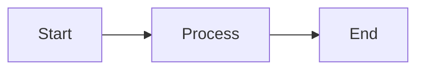

# cdk8s-plone Documentation

This directory contains the complete documentation for cdk8s-plone, built using [Sphinx](https://www.sphinx-doc.org/) with [MyST Parser](https://myst-parser.readthedocs.io/) and following the [Diátaxis framework](https://diataxis.fr/).

## 📚 View Documentation

**Published documentation:** https://bluedynamics.github.io/cdk8s-plone/

## 🏗️ Building Documentation Locally

### Prerequisites

- Python 3.13+ (or Python 3.9+ with manual configuration)
- `make` command
- `uv` (fast Python package installer) - optional but recommended

### Quick Start

```bash
# Navigate to documentation directory
cd documentation

# Build HTML documentation
make docs

# Open in browser
open html/index.html  # macOS
xdg-open html/index.html  # Linux
```

The first build will:
1. Create a Python virtual environment (.venv)
2. Install Sphinx and required extensions
3. Generate HTML documentation

Subsequent builds will reuse the virtual environment and be much faster.

### Development with Live Reload

For documentation writing, use the live-reload server:

```bash
cd documentation
make docs-live
```

This starts a development server at http://localhost:8000 that automatically rebuilds and refreshes when you save changes.

### Clean Build

To remove generated files and rebuild from scratch:

```bash
make clean
make docs
```

## 📝 Documentation Structure

The documentation follows the [Diátaxis framework](https://diataxis.fr/), organizing content into four categories:

```
sources/
├── index.md                  # Main landing page
├── tutorials/                # Learning-oriented (step-by-step lessons)
│   └── index.md
├── how-to/                   # Goal-oriented (solve specific problems)
│   └── index.md
├── reference/                # Information-oriented (technical specs)
│   ├── index.md
│   └── api/                  # API documentation
├── explanation/              # Understanding-oriented (concepts)
│   └── index.md
└── _static/                  # Static assets (CSS, images, fonts)
    ├── brand-theme.css       # Cyberpunk theme styling
    ├── custom-icons.css      # Icon styling
    ├── logo-fix.js           # Logo link fixes
    ├── plone-logo.svg        # Project logo (placeholder)
    ├── kup6s-icon-*.svg      # Category icons
    └── fonts/                # Web fonts (Rajdhani, Orbitron, Hack)
```

### Content Guidelines

#### Tutorials (Learning-Oriented)
- Step-by-step lessons for building skills
- Complete, reproducible examples
- Learning goals clearly stated
- Assumes beginner knowledge

#### How-To Guides (Goal-Oriented)
- Solutions to specific problems
- Assumes some knowledge
- Focus on accomplishing a task
- Recipe-style format

#### Reference (Information-Oriented)
- Technical specifications
- API documentation
- Configuration options
- Dry, factual descriptions

#### Explanation (Understanding-Oriented)
- Conceptual discussion
- Architecture and design decisions
- The "why" behind choices
- Broaden understanding

## 🎨 Theme and Styling

The documentation uses:
- **Theme:** [Shibuya](https://shibuya.lepture.com/) - Modern, responsive Sphinx theme
- **Parser:** [MyST](https://myst-parser.readthedocs.io/) - Markdown with extensions
- **Style:** Cyberpunk-inspired (cyan #00d4ff, dark background)
- **Fonts:**
  - Rajdhani (headings) - geometric, futuristic
  - Hack (body/code) - monospace, highly legible
  - Orbitron (special emphasis) - geometric, bold

## 🔧 Configuration

Key configuration files:

- **`Makefile`** - Build automation (generated by mxmake)
- **`mx.ini`** - mxmake settings
- **`sources/conf.py`** - Sphinx configuration
- **`.gitignore`** - Excludes build artifacts

### Sphinx Extensions

- `myst_parser` - Markdown support
- `sphinxcontrib.mermaid` - Diagram support (```mermaid)
- `sphinx_design` - Grid and card directives
- `sphinx_copybutton` - Copy button for code blocks

### MyST Extensions

- `deflist` - Definition lists
- `colon_fence` - ::: directive syntax for grids/cards
- Mermaid fence as directive

## 📖 Writing Documentation

### Markdown Format

All documentation is written in Markdown with MyST extensions.

**Example:**

```markdown
# Page Title

## Section

Regular Markdown content with **bold**, *italic*, and `code`.

### Code Blocks

\```python
import example
print("Hello, world!")
\```

### Grid Cards (Diátaxis Landing Pages)

::::{grid} 2
:gutter: 3

:::{grid-item-card} Card Title
:img-top: _static/icon.svg
:link: path/to/page
:link-type: doc

Card description
:::

::::
```

### Internal Links

```markdown
[Link text](path/to/file.md)
[Link to section](file.md#section-heading)
```

### Images

```markdown


# Or with MyST directive:
\```{image} path/to/image.png
:width: 200px
:align: center
\```
```

### Tables

```markdown
| Column 1 | Column 2 |
|----------|----------|
| Value 1  | Value 2  |
```

### Diagrams

Use Mermaid for diagrams:

````markdown

````

## 🚀 Deployment

Documentation will be automatically deployed to GitHub Pages via GitHub Actions:

1. **Trigger:** Push to `main` branch or manual workflow dispatch
2. **Build:** Ubuntu runner builds documentation with Sphinx
3. **Deploy:** Artifacts uploaded to GitHub Pages
4. **URL:** https://bluedynamics.github.io/cdk8s-plone/

## 📦 Dependencies

Documentation dependencies (installed automatically by `make docs`):

- sphinx - Documentation generator
- sphinx-autobuild - Live-reload server
- myst_parser - Markdown parser
- sphinxcontrib.mermaid - Mermaid diagram support
- shibuya - Sphinx theme
- sphinx-design - Grid/card directives
- sphinx-copybutton - Code block copy button

## 🤝 Contributing

When contributing to documentation:

1. **Follow Diátaxis categories** - Put content in the right section
2. **Use clear headings** - H1 for page title, H2 for sections
3. **Test locally** - Always build and preview before committing
4. **Check links** - Ensure all internal links work
5. **Use consistent style** - Follow existing formatting patterns
6. **Add images to _static/** - Keep static assets organized

## 🔍 Troubleshooting

### Build Errors

**Error: `sphinx-build: command not found`**
- Solution: Run `make clean` then `make docs` to reinstall dependencies

**Error: Unknown directive type "grid"**
- Solution: Ensure `sphinx_design` is installed: `pip install sphinx-design`

**Error: "Cannot find reference" warnings**
- Solution: Check that linked files exist and paths are correct

### Theme Issues

**Fonts not loading**
- Check that font files exist in `_static/fonts/`
- Verify paths in `brand-theme.css`

**Logo not displaying**
- Ensure `_static/plone-logo.svg` exists
- Check `html_logo` setting in `conf.py`

## 📚 Resources

- [Diátaxis Framework](https://diataxis.fr/) - Documentation organization philosophy
- [MyST Parser Documentation](https://myst-parser.readthedocs.io/) - Markdown syntax reference
- [Sphinx Documentation](https://www.sphinx-doc.org/) - Sphinx features and configuration
- [Shibuya Theme](https://shibuya.lepture.com/) - Theme documentation
- [Mermaid Diagrams](https://mermaid.js.org/) - Diagram syntax

---

**Questions?** Open an issue on GitHub or ask in the project discussions.
