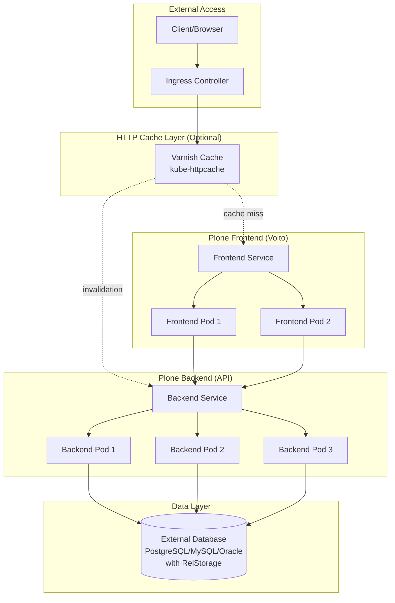

# Architecture Overview

Understanding the architecture and design of cdk8s-plone deployments.

## Overview

cdk8s-plone provides CDK8S constructs for deploying Plone CMS on Kubernetes. The library handles all Kubernetes resources needed for a production-grade Plone deployment.

## Key Features

### Deployment Variants

cdk8s-plone supports two deployment variants:

**Volto (Modern)**
- React-based frontend (Volto)
- REST API backend (Plone)
- Separate services for frontend and backend
- Modern user experience
- Headless CMS architecture

**Classic UI (Traditional)**
- Server-side rendered Plone
- Single integrated service
- Traditional Plone experience
- Simpler deployment model

### High Availability

**Replica Management**
- Configurable number of replicas for backend and frontend
- Default: 2 replicas for each component
- Supports horizontal scaling

**Pod Disruption Budgets**
- Ensures minimum availability during cluster operations
- Configurable `minAvailable` and `maxUnavailable` thresholds
- Protects against voluntary disruptions (node drains, updates)

**Health Probes**
- Readiness probes: Traffic routing only to healthy pods
- Liveness probes: Automatic restart of unhealthy pods
- Configurable delays, timeouts, and thresholds

### HTTP Caching Layer

**Varnish Integration**
- Uses [kube-httpcache](https://github.com/mittwald/kube-httpcache) Helm chart
- Cluster-wide cache invalidation
- HTTP/2 support
- Configurable VCL
- Prometheus metrics export

**Benefits**
- Reduced backend load
- Improved response times
- Better scalability
- Automatic cache invalidation on content changes

### Multi-Language Support

The library is published in multiple languages:

**TypeScript/JavaScript**
- Native CDK8S experience
- Full TypeScript types
- Published to npm: `@bluedynamics/cdk8s-plone`

**Python**
- JSII-generated Python bindings
- Pythonic API
- Published to PyPI: `cdk8s-plone`

## Architecture Diagram

## Component Responsibilities

### Backend

**Responsibilities:**
- Plone REST API
- Content management
- ZODB with RelStorage (external database)
- Search indexing
- Workflow engine

**Resources:**
- CPU: Compute-intensive operations (catalog queries, indexing)
- Memory: ZODB cache, Python processes
- Storage: Delegated to external database (PostgreSQL/MySQL/Oracle)

**Scaling:**
- Horizontal: Add replicas for read scalability with RelStorage
- Vertical: Increase resources for large catalogs
- External database handles storage and multi-writer scenarios

### Frontend (Volto)

**Responsibilities:**
- React single-page application
- Server-side rendering (SSR)
- API client
- User interface

**Resources:**
- CPU: SSR rendering, JavaScript execution
- Memory: Node.js processes, SSR caching
- Storage: Minimal (build artifacts only)

**Scaling:**
- Horizontal: Add replicas for traffic handling
- Vertical: Increase resources for SSR performance
- No shared storage needed (stateless)

### HTTP Cache (Varnish)

**Responsibilities:**
- HTTP caching
- Cache invalidation
- Request routing
- Load distribution

**Resources:**
- CPU: Request processing, cache lookup
- Memory: Cache storage
- Storage: Not required (in-memory cache)

**Scaling:**
- Horizontal: Add replicas for cache distribution
- Vertical: Increase memory for larger cache

## Kubernetes Resources Created

For a typical Volto deployment, cdk8s-plone creates:

**Backend:**
- Deployment (backend pods)
- Service (internal)
- PodDisruptionBudget (optional)
- ConfigMap (optional, for configuration)

**Frontend:**
- Deployment (frontend pods)
- Service (internal)
- PodDisruptionBudget (optional)

**HTTP Cache (optional):**
- StatefulSet (Varnish pods)
- Service (entry point)
- ConfigMap (VCL configuration)
- Secret (admin credentials)
- ServiceMonitor (optional, for Prometheus)

## Design Decisions

### CDK8S Constructs

**Why CDK8S?**
- Type-safe infrastructure as code
- Reusable components
- Familiar programming languages
- No templating required
- IDE support and IntelliSense

**Benefits:**
- Reduced boilerplate
- Better error detection
- Easier testing
- Composition over configuration

### Separate Frontend/Backend

**Volto Architecture:**
- Independent scaling of frontend and backend
- Frontend can be restarted without affecting backend
- Better resource utilization
- Clear separation of concerns

**When to use Classic UI:**
- Simpler deployment model
- Lower resource requirements
- Legacy integrations
- Specific add-on requirements

### Optional Varnish Layer

**Design Choice:**
- Varnish is optional, not mandatory
- Uses established Helm chart (kube-httpcache)
- Cluster-wide cache invalidation
- Production-tested solution

**Trade-offs:**
- Additional complexity
- More resources required
- Better performance at scale
- Reduced backend load

### Health Probes

**Readiness Probe:**
- Enabled by default for backend
- Prevents traffic to unready pods
- Fast startup detection

**Liveness Probe:**
- Disabled by default for backend (Plone is resilient)
- Recommended enabled for frontend (detect SSR hangs)
- Configurable thresholds

## Production Considerations

### Resource Planning

**Backend:**
- Plan for catalog size and query complexity
- ZODB cache size affects memory needs
- Indexing operations are CPU-intensive

**Frontend:**
- SSR requires CPU resources
- Memory for Node.js processes
- Scale based on traffic patterns

**Cache:**
- Memory size determines cache capacity
- Monitor hit rates and adjust sizing

### High Availability

**Recommendations:**
- Minimum 2 replicas per component
- Configure PodDisruptionBudgets
- Use node affinity for distribution
- Enable health probes

**Database:**
- External database required (PostgreSQL, MySQL, or Oracle)
- Uses RelStorage for ZODB persistence
- Enables true multi-writer deployments
- Better backup and recovery options
- MySQL derivatives (MariaDB, Percona) and Oracle are supported but untested

### Monitoring

**Metrics to Track:**
- Pod resource usage (CPU, memory)
- Request rates and latencies
- Cache hit rates
- Error rates
- Health probe failures

**Tools:**
- Prometheus for metrics collection
- Grafana for visualization
- Kubernetes events monitoring

## See Also

- [Plone Variants](plone-variants.md) - Detailed comparison of Volto vs Classic UI
- [Scaling Patterns](scaling-patterns.md) - Horizontal and vertical scaling strategies
- [Configuration Options](../reference/configuration-options.md) - Complete configuration reference
- [Quick Start](../tutorials/01-quick-start.md) - Getting started tutorial
